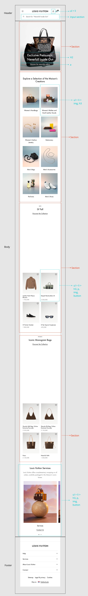
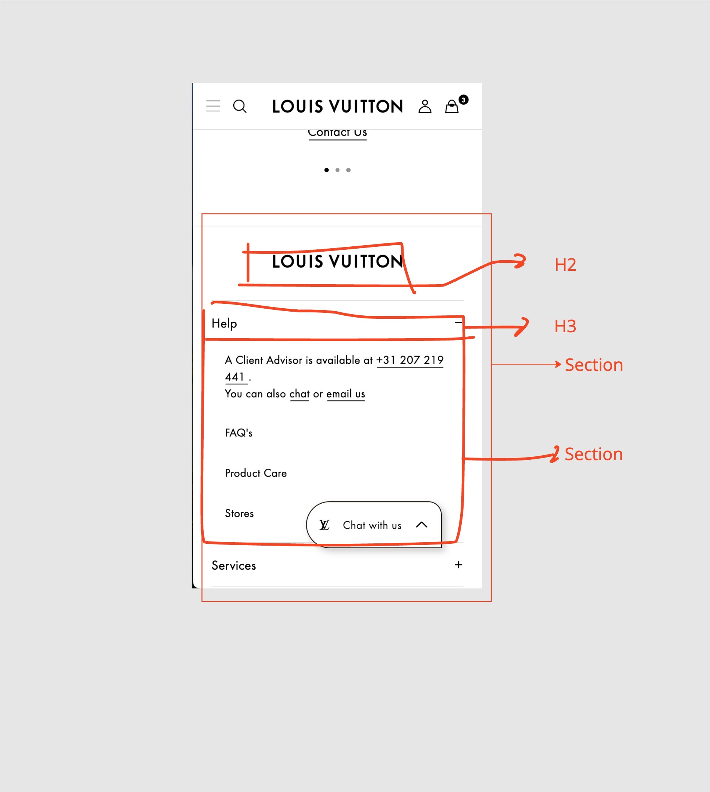

# Procesverslag
Markdown is een simpele manier om HTML te schrijven.  
Markdown cheat cheet: [Hulp bij het schrijven van Markdown](https://github.com/adam-p/markdown-here/wiki/Markdown-Cheatsheet).

Nb. De standaardstructuur en de spartaanse opmaak van de README.md zijn helemaal prima. Het gaat om de inhoud van je procesverslag. Besteedt de tijd voor pracht en praal aan je website.

Nb. Door *open* toe te voegen aan een *details* element kun je deze standaard open zetten. Fijn om dat steeds voor de relevante stuk(ken) te doen.

test test test ik loop een beetje vast hihih

## Jij

  
uitwerken voor kick-off werkgroep

  ### Auteur:
  (Safira Kwyasse)

  #### Je startniveau:
  (blauwe piste)

  #### Je focus:
  (Responsive)
 

## Je website

  
uitwerken voor kick-off werkgroep

  ### Je opdracht:
  [https://en.louisvuitton.com/eng-nl/homepage]

  #### Screenshot(s) van de eerste pagina (small screen): 
  Gymshark  
  

  #### Screenshot(s) van de tweede pagina (small screen):
  Gymshark heren  
  
 

## Toegankelijkheidstest 1/2 (week 1)

  
uitwerken na test in 2e werkgroep

  ### Bevindingen
 	  - De code is niet samantisch.
    - Niet elke pagina heeft een titel.
    - Structuur klopt niet helemaal.
    - Er worden veel DIVS gebruikt. 
    - En CLASSES

## Breakdownschets (week 1)

  
uitwerken na afloop 3e werkgroep

  ### de hele pagina: 
  

  ### dynamisch deel (bijv menu): 
  

## Voortgang 1 (week 2)

  
uitwerken voor 1e voortgang

  ### Stand van zaken
  hier dit ging goed & dit was lastig (neem ook screenshots op van delen van je website en code)

  ### Agenda voor meeting
  samen met je groepje opstellen n.v.t.

  ### Verslag van meeting
  hier na afloop snel de uitkomsten van de meeting vastleggen

- Bij zinnen die een andere taal zijn dan je basis lang geef je een lang=“ attribuut 
- Als  er een woord binnen een zin een andere taal heeft zet je er een span omheen en geen een lang= attribuut 
- Als je nadruk wilt leggen op een woord (bijv. 1 woord rood) geef je het een emphasize element
- Als een video alleen op 1 pagina staat hoort het in de main, ook al het ontworpen als een header
- Paron Gustafson Now You See Me - h2 verstoppen (oude techniek)
- Ally Project How To Hide Content - h2 verstoppen (nieuwe technieken)
- ADL-label als je andere tekst wil laten zien dan er eigenlijk staat - bijv. er staat eigenlijk “beschikbaar in 2 andere kleuren” maar willen laten zien met img
- Als je in html een video of plaatje zet moet je height and width zetten in de html. Zet de verhoudingen erin. Zo weet de pagina welke plek hij moet reserveren

## Voortgang 2 (week 3)

  
uitwerken voor 2e voortgang

  ### Stand van zaken
  Nav: 
- Achtergrond lijkt niet wit
- Begint niet op de juiste plek 
- Gap pakt niet 
- Gap achter de nav 

Form:
- Begint niet op goede plek

H2:
- Staat midden in de pagina 

Main: 
- Moet ook meer naar beneden

GitHub:
- Font

  ### Agenda voor meeting
  samen met je groepje opstellen n.v.t.

  ### Verslag van meeting
  hier na afloop snel de uitkomsten van de meeting vastleggen

  - Add: 3 style pagina’s 
  - CSS structuur: section: nth-of-type(1) ul om te selecteren
  - Schrijf comments om te onthouden wat je doet 

## Toegankelijkheidstest 2/2 (week 4)

  
uitwerken na test in 9e werkgroep

  ### Bevindingen
  Lijst met je bevindingen die in de test naar voren kwamen (geef ook aan wat er verbeterd is):
  - Structureel tabben gaat goed
  - Nog goed oefenen met de screenreader
  - Maak goeie alt teksten

## Voortgang 3 (week 4)

  
uitwerken voor 3e voortgang

  ### Stand van zaken
  Problemen:
- Overflow: Rechts gaat het uit beeld
- Form: Background color werkt niet

  ### Agenda voor meeting
  samen met je groepje opstellen n.v.t.

  ### Verslag van meeting
  hier na afloop snel de uitkomsten van de meeting vastleggen

  - Gebruik Position Rela/Absolute als je elementen over elkaar heen wilt zetten 
  - Wees specifiek met selecteren

## Eindgesprek (week 5)

  
uitwerken voor eindgesprek

  ### Je uitkomst - karakteristiek screenshots:
  
  

  ### Dit ging goed/Heb ik geleerd: 
  Responsive was wel oke gelukt

  

  ### Dit was lastig/Is niet gelukt:
  Was niet gelukt het hamburger-menu button te veranderen in een kruisje

  

## Bronnenlijst

  
continu bijhouden terwijl je werkt

  Nb. Wees specifiek ('css-tricks' als bron is bijv. niet specifiek genoeg). 
  Nb. ChatGpT en andere AI horen er ook bij.
  Nb. Vermeld de bronnen ook in je code.

  1. bron 1: ChatGPT
  2. bron 2: Ali 
  3. bron 3: Mehmet
  4. bron 4: DLO

